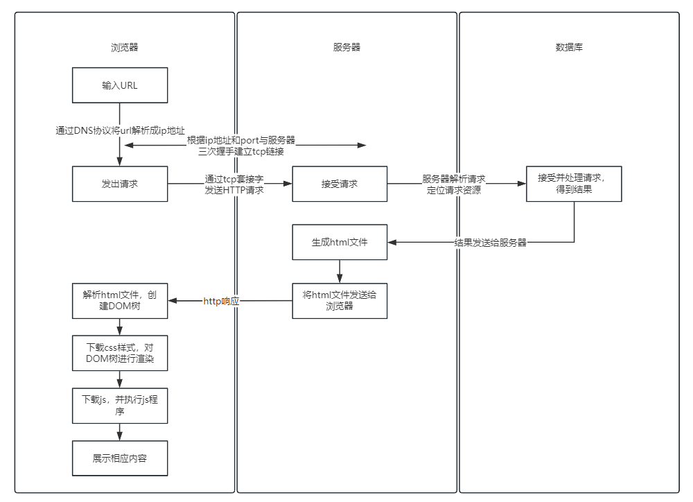
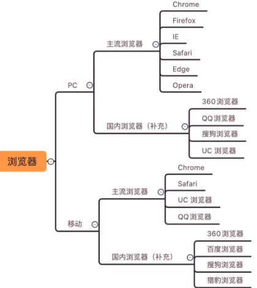
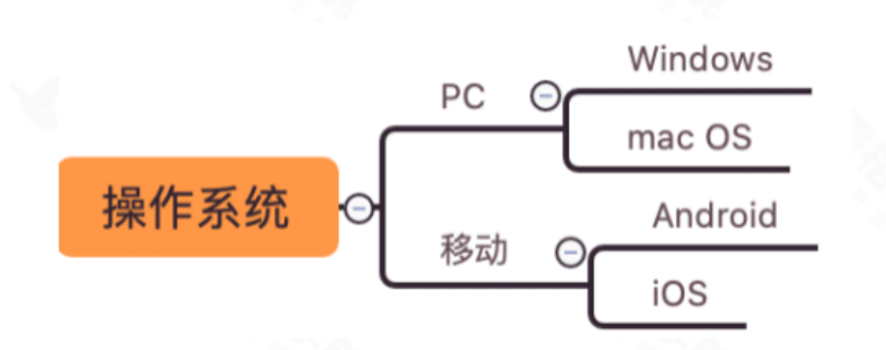
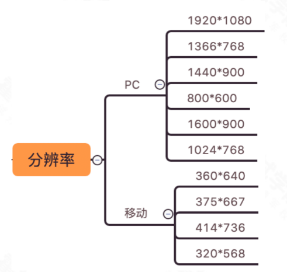
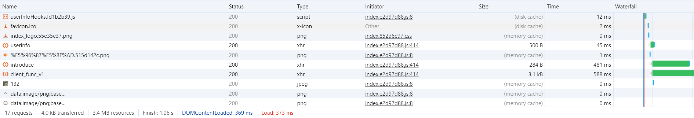

# 开发流程
详细介绍：[测试基础知识](./TestCaseDesign/README.md)
* **CI**
  * 持续集成，团队开发成员经常集成他们的工作，每个成员每天至少集成一次，也就意味可能发生多次集成。每次集成都通过自动化构建来验证，根据测试结果，确定新代码和原有代码是否能正确集成在一起
* **CD**
  * 持续交付，让软件产品的产出过程在一个短周期内完成，以保证软件可以稳定、持续的保持在随时可以发布的状况。目标在于频繁的让软件的构建、测试与发布变得更快以及频繁。减少开发成本和风险
* **左移**
  * 开发阶段就发现问题 
* **右移**
  * 产品上线后的测试，发现问题提给开发
## 测试分类
* **单元测试：**
  测试一个个独立的模块
* **集成测试：**
将以一个小的独立模块，集成到一起测试
* **系统测试：**
将所有流程组合到一起，进行一次测试（比如集成测试后代码都合并到了主分支，在测一遍主分支代码）
  * 功能测试：功能是否正常
  * 兼容测试：多个平台是否都正常
  * 性能测试：性能是否达到要求（系统性能占用情况）
  * 安全测试
* **验收测试：**
  产品上线之前在进行一次验证
  * 内测
  * 公测
* **白盒测试：** 
查看源代码，关心内部源代码的逻辑结构
* **黑盒测试：**
不查看源代码，不关心内部实现，只关心新输入输出（从用户角度考虑）
* **灰盒测试：**
只查看一部分代码
* **静态测试：** 
不运行程序
* **动态测试：**
运行程序
* **手动测试：** 
* **自动化测试：**
* **冒烟测试：**
只测试基本功能（节省时间成本）
* **回归测试：**
验证改好的bug，并查看是否有新的bug出现
* **随机测试：**
随机的操作各种功能
* **探索性测试：**
## 测试流程

* 需求分析：分析产品需求，确认测试的范围和目标
* 需求评审：评估产品需求是否可行，并确定测试策略和方法
* 编写测试计划：明确测试人员要测试的模块，以及提交文档的期限
* 编写测试用例：设计测试方法和策略，形成指导测试的文档
* 用例评审：审查测试用例的合理性和完整性，确保测试的正确性和有效性
* 执行测试：根据测试用例，实际执行测试，记录测试结果
* 提交bug：发现缺陷后，提交给开发人员进行修复
* 回归测试：验证开发人员是否已正确修复缺陷
* 编写测试总结报告：总结测试情况，包括软件的质量评估
## 需求文档
* 需求评审
  * 业务场景：业务流程是否合理
  * 功能点：
    * 数据约束是否全面、合理
    * 分支逻辑，是否覆盖全部路径
    * 多状态流程，状态流转描述是否合理且完整
    * 权限描述是否合理
* 需求分析
  * 明确测试范围（比如是是否需要测试关联模块）
  * 明确功能点
  * 明确业务流程
  * 明确输出结果
  * 分析异常流程
  * 预估测试需要的时间和资源
## bug定位
* 功能bug：
功能是否正确
* 性能bug：
功能是否流畅
* 安全bug：
是否符合安全标准规范
* 专项质量：
用户体验兼容性、稳定性、可靠性

# 用户端测试
## WEB
#### 基础知识
* C/S 客户端服务器架构
* B/S 浏览器服务器架构：
  * 界面层
  * 业务逻辑层
  * 数据访问层

**DNS协议：** 首先主机会查询**浏览器的DNS缓存**，如果没有就查询**操作系统**，操作系统也没有查看**hosts文件**，都没有之后查询**本地域名服务器->根域名服务器->权威服务器1->2...**

**浏览器输入url后回车，发生了什么：**

#### HTML
<a href="./WEB/html.md"> html使用 </a>

#### JavaScript
<a href="./WEB/JavaScript.md"> js使用 </a>

#### CSS
<a href="./WEB/css.md"> css使用 </a>

#### WEB测试流程
  * 需求分析
  * 测试计划编写
  * 测试用例设计
  * 用例执行
  * 回归测试
  * 兼容性测试
  * 安全测试
  * 走查测试
  * 测试总结报告
#### WEB测试用例设计
* **UI测试**
  * 界面风格是否统一
  * 文案是否正确
  * 提示、警告或错误说明描述准确
  * 切换窗口大小，将窗口缩小后，页面是否按比例缩小或出现滚动条，页面是否正确显示
  * 所有的图片是否都被正确装载
  * 在不同的浏览器、分辨率下图片是否能正确显示
* **搜索测试**
  * 如果支持模糊查询，搜索名称中任意一个字符是否能搜索到
  * 比较长的名称是否能查到
  * 输入系统中不存在的与之匹配的条件
  * 不同查询条件之间来回选择，是否出现页面错误（按时间查找，关键词查找等）
  * 查询条件的组合测试
* **表单测试**
  * 表单按钮功能正常实现
  * 下拉列表数据完整、正确，可以正常选择，是否支持模糊匹配
  * 文件上传大小、尺寸、格式、数量、文件内容规则验证
  * 表单提交，删除，修改后是否有提示信息
  * 浏览器的前进、后退、刷新按钮，是否会造成数据重现或页面报错
  * 提交表单是否支持回车键和 Tab 键
  * 数据重复检验
  * 提交的数据是否能正确保存到数据库中
* **输入框测试**
  * 输入类型检验
  * 输入长度检验
  * 必填项检验
  * 重复性检验
  * 空格检查
  * 安全性检查
* **分页测试**
  * 没有数据时界面展示情况
  * 翻页后数据展示情况
  * 分页的总页数及当前页数显示是否正确
  * 是否能正确跳转到指定的页数
* **交互性数据测试**
  * 前台的数据操作是否对后台产生相应正确的影响
  * 用户的权限，是否随着授权而变化
* **连接测试**
  * 是否能够直接链接查看
  * 是否有权限控制
  * 是否直接执行，并返回相应结果页
#### WEB端常见bug
##### 界面布局
* 页面一行内容超长展示错乱
* 更换设备，布局错乱
##### 界面元素方面
* 输入域提示信息不明确
* 输入框包含 HTML 字符时出现异常
##### 功能方面
* 功能不符合需求
* 提示信息错误
* js脚本报错
* 更改不同步
* 登录状态不同步
##### 其他
* 页面请求失败
* 加载时间太长
## 兼容性测试
* 浏览器
* 操作系统
* 分辨率

## 浏览器开发者工具
* network
  * Name：资源名称以及 URL 路径
  * status：Http 状态码/文字解释
  * Type：请求资源的类型
  * Initiator：解释请求是怎么发起的
  * Size：服务器提供的响应头加上响应主体的总大小
  * Time：从请求开始到响应中最后一个字节接收的总持续时间
  * Waterfall：每个请求活动的可视细分

## APP
