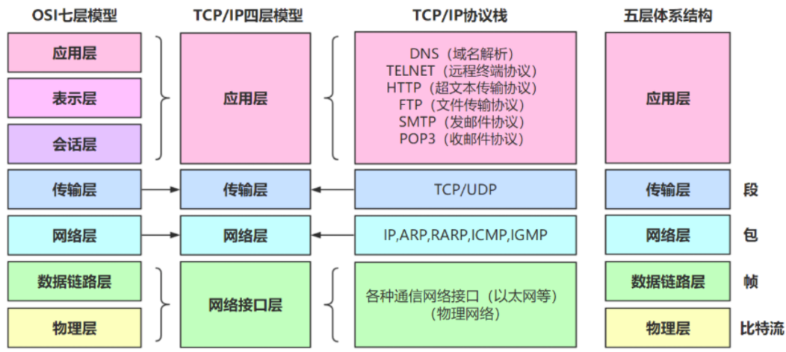
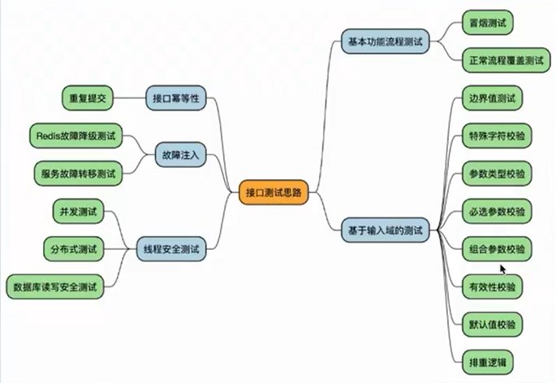

# 开发流程
详细介绍：[测试基础知识](./TestCaseDesign/README.md)
* **CI**
  * 持续集成，团队开发成员经常集成他们的工作，每个成员每天至少集成一次，也就意味可能发生多次集成。每次集成都通过自动化构建来验证，根据测试结果，确定新代码和原有代码是否能正确集成在一起
* **CD**
  * 持续交付，让软件产品的产出过程在一个短周期内完成，以保证软件可以稳定、持续的保持在随时可以发布的状况。目标在于频繁的让软件的构建、测试与发布变得更快以及频繁。减少开发成本和风险
* **左移**
  * 开发阶段就发现问题 
* **右移**
  * 产品上线后的测试，发现问题提给开发
## 测试分类
* **单元测试：**
  测试一个个独立的模块
* **集成测试：**
将以一个小的独立模块，集成到一起测试
* **系统测试：**
将所有流程组合到一起，进行一次测试（比如集成测试后代码都合并到了主分支，在测一遍主分支代码）
  * 功能测试：功能是否正常
  * 兼容测试：多个平台是否都正常
  * 性能测试：性能是否达到要求（系统性能占用情况）
  * 安全测试
* **验收测试：**
  产品上线之前在进行一次验证
  * 内测
  * 公测
* **白盒测试：** 
查看源代码，关心内部源代码的逻辑结构
* **黑盒测试：**
不查看源代码，不关心内部实现，只关心新输入输出（从用户角度考虑）
* **灰盒测试：**
只查看一部分代码
* **静态测试：** 
不运行程序
* **动态测试：**
运行程序
* **手动测试：** 
* **自动化测试：**
* **冒烟测试：**
只测试基本功能（节省时间成本）
* **回归测试：**
验证改好的bug，并查看是否有新的bug出现
* **随机测试：**
随机的操作各种功能
* **探索性测试：**
## 测试流程

* 需求分析：分析产品需求，确认测试的范围和目标
* 需求评审：评估产品需求是否可行，并确定测试策略和方法
* 编写测试计划：明确测试人员要测试的模块，以及提交文档的期限
* 编写测试用例：设计测试方法和策略，形成指导测试的文档
* 用例评审：审查测试用例的合理性和完整性，确保测试的正确性和有效性
* 执行测试：根据测试用例，实际执行测试，记录测试结果
* 提交bug：发现缺陷后，提交给开发人员进行修复
* 回归测试：验证开发人员是否已正确修复缺陷
* 编写测试总结报告：总结测试情况，包括软件的质量评估
## 需求文档
* 需求评审
  * 业务场景：业务流程是否合理
  * 功能点：
    * 数据约束是否全面、合理
    * 分支逻辑，是否覆盖全部路径
    * 多状态流程，状态流转描述是否合理且完整
    * 权限描述是否合理
* 需求分析
  * 明确测试范围（比如是是否需要测试关联模块）
  * 明确功能点
  * 明确业务流程
  * 明确输出结果
  * 分析异常流程
  * 预估测试需要的时间和资源
## bug定位
* 功能bug：
功能是否正确
* 性能bug：
功能是否流畅
* 安全bug：
是否符合安全标准规范
* 专项质量：
用户体验兼容性、稳定性、可靠性

# 用户端测试
## WEB
#### 基础知识
* B/S 浏览器服务器架构：
  * 界面层
  * 业务逻辑层
  * 数据访问层

**DNS协议：** 首先主机会查询**浏览器的DNS缓存**，如果没有就查询**操作系统**，操作系统也没有查看**hosts文件**，都没有之后查询**本地域名服务器->根域名服务器->权威服务器1->2...**

**浏览器输入url后回车，发生了什么：**

#### HTML
<a href="./WEB/html.md"> html使用 </a>

#### JavaScript
<a href="./WEB/JavaScript.md"> js使用 </a>

#### CSS
<a href="./WEB/css.md"> css使用 </a>

#### WEB测试流程
  * 需求分析
  * 测试计划编写
  * 测试用例设计
  * 用例执行
  * 回归测试
  * 兼容性测试
  * 安全测试
  * 走查测试
  * 测试总结报告
#### WEB测试用例设计
* **UI测试**
  * 界面风格是否统一
  * 文案是否正确
  * 提示、警告或错误说明描述准确
  * 切换窗口大小，将窗口缩小后，页面是否按比例缩小或出现滚动条，页面是否正确显示
  * 所有的图片是否都被正确装载
  * 在不同的浏览器、分辨率下图片是否能正确显示
* **搜索测试**
  * 如果支持模糊查询，搜索名称中任意一个字符是否能搜索到
  * 比较长的名称是否能查到
  * 输入系统中不存在的与之匹配的条件
  * 不同查询条件之间来回选择，是否出现页面错误（按时间查找，关键词查找等）
  * 查询条件的组合测试
* **表单测试**
  * 表单按钮功能正常实现
  * 下拉列表数据完整、正确，可以正常选择，是否支持模糊匹配
  * 文件上传大小、尺寸、格式、数量、文件内容规则验证
  * 表单提交，删除，修改后是否有提示信息
  * 浏览器的前进、后退、刷新按钮，是否会造成数据重现或页面报错
  * 提交表单是否支持回车键和 Tab 键
  * 数据重复检验
  * 提交的数据是否能正确保存到数据库中
* **输入框测试**
  * 输入类型检验
  * 输入长度检验
  * 必填项检验
  * 重复性检验
  * 空格检查
  * 安全性检查
* **分页测试**
  * 没有数据时界面展示情况
  * 翻页后数据展示情况
  * 分页的总页数及当前页数显示是否正确
  * 是否能正确跳转到指定的页数
* **交互性数据测试**
  * 前台的数据操作是否对后台产生相应正确的影响
  * 用户的权限，是否随着授权而变化
* **连接测试**
  * 是否能够直接链接查看
  * 是否有权限控制
  * 是否直接执行，并返回相应结果页
* **兼容性测试**
  * 浏览器
  * 操作系统
  * 分辨率

#### WEB端常见bug
##### 界面布局
* 页面一行内容超长展示错乱
* 更换设备，布局错乱
##### 界面元素方面
* 输入域提示信息不明确
* 输入框包含 HTML 字符时出现异常
##### 功能方面
* 功能不符合需求
* 提示信息错误
* js脚本报错
* 更改不同步
* 登录状态不同步
##### 其他
* 页面请求失败
* 加载时间太长

##### Bug 定位思路
要去判断发现的 bug 是属于前端还是接口
界面样式展示类错误，一般是前端的 bug
数据错误，确认错误的数据是前端写的，还是从接口拿的
判断方式：拿到要判断的数据，到浏览器开发者工具的 Network 里，搜索是否存在与接口数据包中（Ctrl+F）
如果只能在 html js css 这类文件中搜索到，基本是前端写的数据
接下来就可以查看 html 源码（Elements 面板），如果源码中错误，确定是前端 bug
如果在异步请求中可以搜索到数据（Fetch/），那么数据基本是从接口拿到的
接口下来要先判断前端发起的请求是否正确（请求方法、请求地址，请求头信息，请求参数），如果请求发起有错误，是前端的问题
如果前端发起请求正确，响应中的数据错误，可以确定是接口的 bug

## 浏览器开发者工具
* network
  * Name：资源名称以及 URL 路径
  * status：Http 状态码/文字解释
  * Type：请求资源的类型
  * Initiator：解释请求是怎么发起的
  * Size：服务器提供的响应头加上响应主体的总大小
  * Time：从请求开始到响应中最后一个字节接收的总持续时间
  * Waterfall：每个请求活动的可视细分

## APP
* C/S 客户端服务器架构
##### APP测试流程
* 需求分析
* 测试计划编写
* 测试用例设计
* 测试用例评审
* 用例执行
* 回归测试
* 非功能测试
* 走查验收（UI、产品）
* 测试总结报告
* 灰度发布
* 上线
##### APP测试设计思路
[APP测试用例设计](./APP/APP.xmind)

##### APP常见bug
* 功能 Bug
  * 内容显示
  * 功能bug
  * 界面错乱
  * 界面展示后台信息
  * 推送信息错误 
* 崩溃 Bug
* 性能 Bug
  * 加载速度慢
    * 程序启动速度慢
    * 界面加载速度慢
    * 动画效果的界面，动画执行过程加载度慢并且有卡顿
    * 响应某一个用户事件时，长时间无响应（ANR）
* 其他
  * 太占用手机内存
  * 太耗电和流量
  * 在使用应用的过程中，点击某一个事件进入的页面现白屏的闪动等
##### adb使用
[adb常用命令](./APP/adb.md)

## 接口测试
检查数据的交换、传递和控制管理过程

##### HTTP协议
* 请求
  * 请求行：method url protocol
  * 请求方法：GET、POST、PUT、DELETE、HEAD
  * 请求头: Host Cookie User-Agent
  * 请求参数 query
  * 请求体：JSON XML FORM
* 响应:
  * 响应状态行
  * 响应头
  * 响应体

**请求方法**
* GET: 获取资源
* POST: 新增或者更新
* PUT: 更新资源
* DELETE: 删除资源

**get和post的区别？**
* get方式的请求，浏览器会把http header 和 data一起发送出去，服务器响应200 ok
  
* 对于post，浏览器会先发送http header 服务器响应100 continue 之后在发送data服务器响应ok

**区别：**
* get参数通过url传递，post放在request body中
* get请求在url中传递的参数时有长度限制的，而post没有
* get比post更不安全，因为参数直接暴露在url中，所以不能用来传递敏感信息
* get请求只能进行url编码，而post支持多种编码方式
* get请求参数会被完整保留在浏览历史记录里，而post中的参数不会被保留

**http状态码**
* 1xx：表示通知信息，如请求收到了或正在进行处理
  * 100 Continue：继续，客户端应继续其请求
* 2xx:表示成功，如接收或知道了
  * 200 OK: 请求成功
* 3xx：表示重定向，如要完成请求还必须采取进一步的行动
  * 301 永久移动
  * 302 临时移动
* 4xx：表示客户的差错，如请求中有错误的语法或不能完成
  * 403 未授权（没权限）
  * 404 Not Found: 服务器无法根据客户端的请求找到资源（网页）
* 5xx：表示服务器的差错，如服务器失效无法完成请求
  * 500 服务器内部错误
  * 503 服务器不可用
##### 接口测试用例设计

* 接口测试用例要素
  * 用例名称
  * 接口地址
  * 请求方式
  * 前置条件
  * 请求头部
  * 请求参数
  * 响应状态码
  * 预期响应结果
##### postman

[postman操作](./Post/Post.md)

## Linux
[linux使用](./Linux/linux.md)

## SQL
[sql语法](./Sql/sql.md)

SELECT语句的基本用法：
* 查询所有列的语法：SELECT * FROM 表名;
* 查询指定列的语法：SELECT 列名1, 列名2 FROM 表名;
* 指定条件查询：SELECT * FROM 表名 WHERE 条件;

常用的SQL聚合函数：
* COUNT函数：计算指定列的行数。
* SUM函数：计算指定列的总和。
* AVG函数：计算指定列的平均值。
* MAX函数：返回指定列的最大值。
* MIN函数：返回指定列的最小值。

SQL中的连接操作：
* INNER JOIN：返回两个表中匹配的行。
* LEFT JOIN：返回左边表中的所有行，以及匹配的右边表中的行。
* RIGHT JOIN：返回右边表中的所有行，以及匹配的左边表中的行。

SQL中的数据过滤：
* WHERE子句：用于筛选符合特定条件的行。
* LIKE操作符：用于模糊匹配。
* IN操作符：用于检查某个列的值是否与给定的值列表中的任何一个匹配。

SQL中的排序：
* ORDER BY子句：用于按照指定列的值对结果进行排序。
* ASC关键字：按升序排序。
* DESC关键字：按降序排序。

SQL中的分组与聚合：
* GROUP BY子句：按照指定的列对结果进行分组。
* HAVING子句：用于过滤分组后的结果。

SQL中的子查询：
* 子查询是嵌套在主查询中的查询，用于处理复杂的查询需求。
-----------------------------------

##### mysql 常见问题
* **MySQL索引使用的注意事项**
* **DDL、DML、DCL分别指什么**
* **explain命令：**
  * EXPLAIN命令用于分析查询语句的执行计划，可以帮助优化查询性能
* **数据库事务特性ACID：**
  * 原子性（Atomicity）
  * 一致性（Consistency）
  * 隔离性（Isolation）
  * 持久性（Durability）

* **事物的隔离级别：**
  * 读未提交
  * 读已提交
  * 可重复读
  * 可序列化读

* **脏读、幻读、不可重复读：**
  * 并发控制中出现的问题
  * 脏读：读取到了另一个事务未提交的数据
  * 幻读：两次执行相同的查询语句得到的结果集不一致
  * 不可重复读：两次读取同一行数据时得到的结果不一致

* **数据库的几大范式：**
  * 第一范式（1NF）：属性（字段）是最小单位不可再分
  * 第二范式（2NF）：满足 1NF，每个非主属性完全依赖于主键（消除 1NF 非主属性对码的部分函数依赖）
  * 第三范式（3NF）：满足 2NF，任何非主属性不依赖于其他非主属性（消除 2NF 非主属性对码的传递函数依赖）
  * 鲍依斯-科得范式（BCNF）：满足 3NF，任何非主属性不能对主键子集依赖（消除 3NF 主属性对码的部分和传递函数依赖）
  * 第四范式（4NF）：满足 3NF，属性之间不能有非平凡且非函数依赖的多值依赖（消除 3NF 非平凡且非函数依赖的多值依赖）

* **数据库常见的命令：**
  * 包括SELECT、INSERT、UPDATE、DELETE等，用于对数据库进行数据的查询、插入、更新和删除操作。

* **分库与分表设计：**
  * 是指将数据库按照一定规则进行拆分，以应对大数据量和高并发的需求

* **存储引擎的InnoDB与MyISAM区别，优缺点，使用场景：**
  * InnoDB：提供了事务支持、行级锁、外键约束等特性，适合于大多数应用场景
  * MyISAM：不支持事务、只提供表级锁，适用于读密集型的应用场景

* **索引类别：**
  * B 树索引：
    * 优点：
      * 支持范围查询和顺序遍历
      * 具有良好的平衡性和高度平衡的检索性能
      * 支持高效的查找、插入和删除操作，维护成本相对较低

    * 缺点：
      * 不适合于大规模的数据插入和删除操作，可能导致树的频繁调整和维护
      * 占用更多的内存空间，不适用于内存受限的环境
      * 不支持高并发的写操作，可能会导致锁竞争和性能下降
  * 哈希索引：
    * 优点：
      * 对于等值查询具有较好的性能，查找速度快
      * 占用较少的内存空间，适用于内存受限的环境
    * 缺点：
      * 不支持范围查询和顺序遍历
      * 不支持部分匹配和模糊查询，无法应对复杂的查询需求
      * 哈希冲突可能导致查询性能下降，需要解决冲突问题
  * 全文索引：
    * 优点：
      * 支持对文本数据进行全文搜索和关键词匹配
      * 可以进行模糊匹配、部分匹配和相似度排序等操作
      * 适用于对文本内容进行搜索和匹配的场景，如文章、博客、新闻等
    * 缺点：
      * 对于大规模的文本数据，全文索引可能占用较多的存储空间
      * 全文搜索的复杂性和性能开销较高

* **自适应哈希索引（AHI）：**
  * 是一种MySQL存储引擎InnoDB中的索引类型，用于提高查询性能

* **为什么要用B+tree作为MySQL索引的数据结构：**
  * B+tree索引适用于范围查询、有序性查询等场景，且能够高效支持高并发的插入和删除操作

* **索引失效的情况：**
  * 索引失效是指数据库查询时未能使用到索引，常见的情况包括数据量过小、查询条件不符合索引的前缀顺序等

* **limit20000加载很慢怎么解决：**
  * 可以通过优化查询语句、增加合适的索引、使用分页技术等方法来解决

* **常见的数据库优化方案：**
  * 包括查询优化、索引优化、分表分库、硬件优化等。

---------------------------------