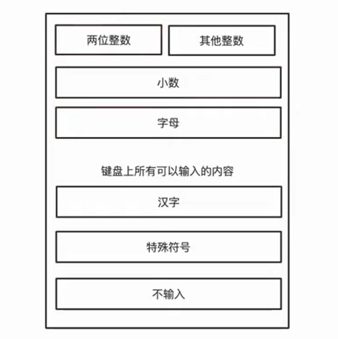
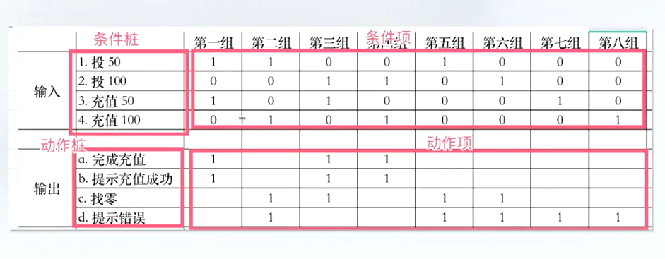
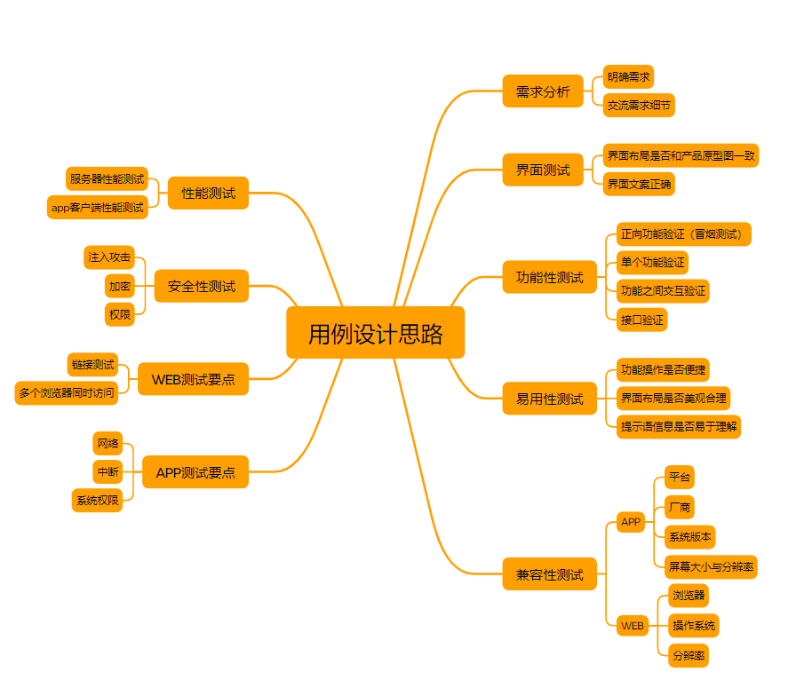
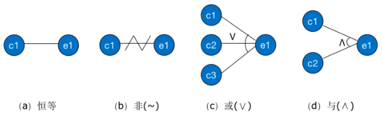
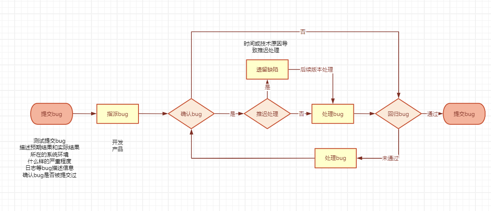

# 测试体系
## 测试框架
* TDD：
代码风格
* DDT：
数据驱动风格
* ATDD：
验收测试驱动开发
* BDD：
行为驱动开发
* MBT：
基于模型的测试
## 持续交付与 DevOps 体系

## 测试左移
## 测试右移
## 精准测试
  
# 黑盒测试
## 等价法
将输入分成若干个子集，从每个子集抽取具有代表性的数据进行测试（比如两位整数计算器输入，如下图）
  * 有效等价：合理输入
  * 无效等价：不合理输入!
  

* **等价类划分原则：**
  * 规定输入的取值范围或个数时，划分一个有效和两个无效
  * 规定了输入的集合或规则必须要遵循的条件，则划分一个有效和一个无效
  * 输入条件是一个布尔值，则划分未一个有效和一个无效
  * 输入条件是一组数据，并且么一个输入的值做不通处理，则划分若干个有效和一个无效
  * 输入条件规定了必须要遵循某些规则下，则划分未一个有效和若干个无效
  * 不是所有的等价类都有无效等价类
* **设计步骤：**
  * 划分等价类：找出所有等价类情况
  * 确定有效等价类：需求中的情况
  * 确定无效等价类：相反的情况，特殊用例
  * 从各个分类挑选测试用例

## 边界值分析法
**需求 输出 >=0  <=99 的整数** 比如 for(int i = 0; i < 99;i++) 只输出0~98

选取正好等于、刚好大于或刚好小于边界值作为测试数据（0、99、100、-1）

## 判定表
* 判定表组成
  * 条件桩：问题的所有条件
  * 动作桩：问题所有输出
  * 条件项：针对条件桩的取值
  * 动作项：条件项各种取值情况下的输出结果

## 场景法
模拟用户使用情况

基本流：正常操作流程

备选流：错误的操作流程
* **设计步骤**
  * 根据需求规格说明，画出功能模块的流程图
  * 根据流程图，描述出程序的基本流和备选流
  * 根据基本流和备选流生成不同场景，构造场景列表
  * 对每一个场景生成对应的测试用例
  * 对生成的所有测试用例重复复审，去掉多余的测试用例
  * 测试用例确定后，为每个测试用例确定测试数据值
## 设计测试用例
### 测试方法选择
* 任何时候都需要等价法，将无限测试变为有限测试
* 任何规定了数据范围，必须采用边界值分析法
* 如果需要关注主要功能、业务流程、业务逻辑是否正确实现，考虑使用场景法
* 如果含有输入条件的组合情况，考虑使用判定表发
* 采用错误推断法追加测试用例
### 测试用例编写步骤
* 划分功能模块
* 正向功能验证
* 单个功能验证
* 功能之间交互验证
* 隐形需求
### 示例

[测试用例](../LoginTest/README.md)

## 因果图法
因 —— 输入条件

果 —— 输出结果
* 恒等：若原因出现，则结果出现；若原因不出现，则结果也不出现
* 非：若原因出现，则结果不出现；若原因不出现，则结果出现
* 或：有多个原因。若几个原因中有一个出现，则结果出现；若几个原因都不出现，则结果不出现
* 与：有多个原因。若几个原因都出现，则结果才出现；若其中一个原因不出现，则结果不出现

* 互斥 E：a、b、c 只能有一个成立，但是可以都不成立
* 包含 I：a、b、c 中至少有一个成立
* 唯一 O：a、b、c 有且仅有一个成立
* 要求 R：如果 a 成立，则要求 b 必须也成立，其他的不约束
* 屏蔽 M：如果 a 成立的时候，强制 b 不成立，其他的不约束

## 基于模型测试
===========================================
## 测试计划
5W + H 原则
* why：为什么要进行这些测试
* what：测试哪些方面，不同阶段的工作内容
* when：测试不同阶段的起止时间
* where：相应文档，缺陷的存放位置，测试环境等
* who：项目有关人员组成，安排哪些测试人员进行测试
* how：如何去做，使用哪些测试工具以及测试方法进行测试

## bug判定
* 开发觉得提交的bug不是bug？
  * **bug描述不够清晰**：提高自己的水平。
    * 完善bug复现步骤，将日志、录屏、问题截图等，完善到bug描述中
  * **偶现bug**：留好证据，截图、录屏、日志等信息，为后面发现做准备。
    * 当bug按照步骤难以复现时，保留bug截图、录屏、日志等信息，保留证据
  * **争议bug（建议类）**：开会讨论。
    * 和产品、开发一起讨论，根据自己的依据表达清楚自己的建议，最终改不改取决于产品或者领导
  * **功能性bug（需求理解不一致的bug）**：提供证据，需求文档，产品原型等，可以省去很多争议。
    * 功能确实存在bug，但是从开发的角度觉得没有问题，或者开发对需求分析不够全面，对于这种要摆出证据，拿出需求给到开发
## bug处理流程
