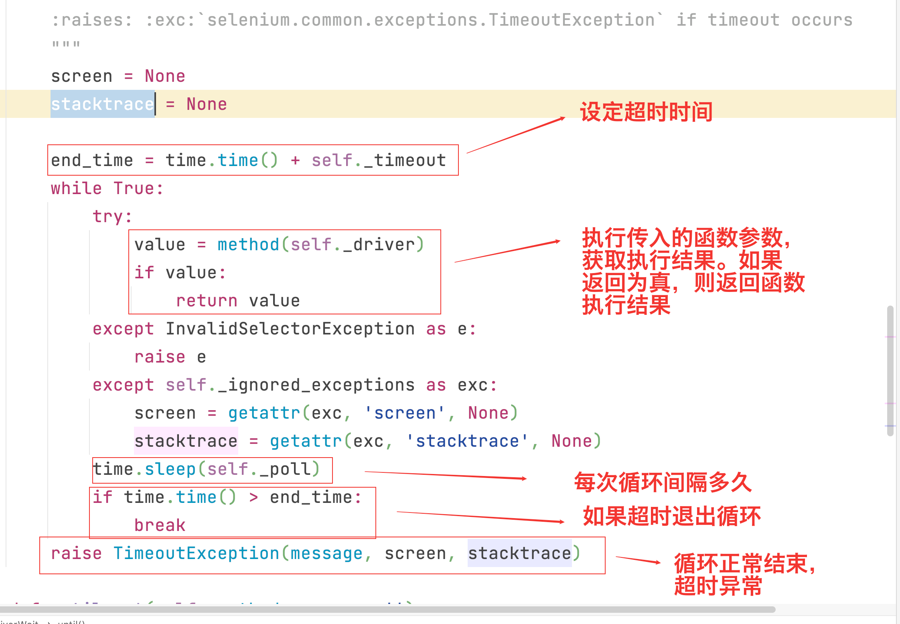

|| 自动化测试用例 | 说作用明 |
|-------|-------|-------|
|用例标题|	测试包、文件、类、方法名称|	用例的唯一标识|
|前提条件|	setup、setup_class(Pytest); BeforeEach、BeforeAll（JUnit）	|测试用例前的准备动作，比如读取数据或者driver的初始化|
|用例步骤|	测试方法内的代码逻辑|	测试用例具体的步骤行为|
|预期结果|	assert 实际结果 = 预期结果|	断言，印证用例是否执行成功|
|实际结果|	assert 实际结果 = 预期结果|	断言，印证用例是否执行成功|
|后置动作|	teardown、teardown_class(Pytest); @AfterEach、@AfterAll（JUnit）||

## 浏览器控制
|	|操作|	使用场景|
|-------|-------|-------|
|get|	打开浏览器|	web自动化测试第一步|
|refresh|	浏览器刷新|	模拟浏览器刷新|
|back|	浏览器退回|	模拟退回步骤|
|maximize_window|	最大化浏览器|	模拟浏览器最大化|
|minimize_window|	最小化浏览器|	模拟浏览器最小化|
```python
from selenium import webdriver

def open_browser():
    driver = webdriver.Chrome()
    driver.get("https://www.baidu.com")
    # 刷新浏览器
    driver.refresh()
    # 退回上一步
    driver.back()
    # 最大化
    driver.maximize_window()
    # 最小化
    driver.minimize_window()

if __name__ == '__main__':
    # 打开浏览器
    open_browser()
```
## 常见控件定位方法
|方式|	描述|
|-------|-------|
|class name|class 属性对应的值|
|css selector（重点）|	css 表达式|
|id（重点）|	id 属性对应的值|
|name（重点）|	name 属性对应的值|
|link text|	查找其可见文本与搜索值匹配的锚元素|
|partial link text|	查找其可见文本包含搜索值的锚元素。如果多个元素匹配，则只会选择第一个元素|
|tag name|	标签名称|
|xpath（重点）|	xpath表达式|
```python
from selenium import webdriver
from selenium.webdriver.common.by import By

def open_browser():
    driver = webdriver.Chrome()
    driver.get("https://vip.ceshiren.com/#/ui_study/frame")

    # ID定位，第一个参数定位方式，第二个参数定位元"素
    web_element = driver.find_element(By.ID,"locate_id")
    print("ID: ",web_element)

    # name定位
    web_element = driver.find_element(By.NAME,"locate")
    print("NAME: ",web_element)

    # CSS表达式定位
    web_element = driver.find_element(By.CSS_SELECTOR,"#locate_id > a > span")
    print("CSS: ",web_element)

    # Xpath定位
    web_element = driver.find_element(By.XPATH,'//*[@id="locate_id"]/a/span')
    print("Xpath: ",web_element)

    # 链接文本定位，元素一定是<a>标签，输入的元素为标签内的文本
    web_element = driver.find_element(By.LINK_TEXT,'元素定位').click() # click() 点击操作
    print("LINK: ",web_element)

if __name__ == "__main__":
    open_browser()
```

## 三种等待
> 加等待的原因：定位某个元素的时候，如果界面还没加载完成，此时需要定位的元素还没加载出来，导致定位不到该元素，发生报错
* 强制(直接)等待: 线程休眠一定时间，等待元素完全加载(不能确定加载时间)
    * 带来的问题：
        * 等待时间过长，降低执行效率
        * 等待时间过短，元素未加载出来，产生错误
* 隐式等待: 设置一个等待时间，轮询查找（默认0.5秒）元素是否出现，如果没出现就抛出异常（只能解决元素查找，不能解决元素交互）
* 显示等待: 在最长等待时间内，轮询，是否满足结束条件
```python
# 强制等待
time.sleep(3)

# 隐式等待
# 隐式等待就是对webdriver的实例对象做一个配置，如果没有设置隐式等待webdriver里面的超时时间属性默认是0
# 隐式等待是全局生效的，在每个find_elenemt动作之前都会执行

# 元素可以找到，使用点击等操作，出现报错
# 界面元素加载是异步的，html加载完成，在加载js、css
# html只关注元素是否存在，交互有js和css决定
driver.implicitly_wait(3)

# WebDriverWait(driver实例, 最长等待时间, 轮询时间).until(结束条件)
WebDriverWait(driver,10).until(expected_conditions.element_to_be_clickable((By.ID,"success_btn")))

```
## 定位策略
* 与研发约定的属性优先(class属性： [name='locate'])
* 身份属性 id，name(web 定位)
* 复杂场景使用组合定位：
    * xpath，css
    * 属性动态变化（id，text）
    * 重复元素属性（id，text，class）
    * 父子定位（子定位父）
* js定位
## css相对定位
* css定位调试方法
```css
$("css表达式")
$$("css表达式")
```
* css定位方式

|类型|表达式|
|------|------|
|标签|标签名|
|类名|.class属性值|
|ID|#id属性值|
|属性|[属性名='属性值']|

* css关系定位

|类型|	格式|
|------|------|
|并集|	元素,元素|
|邻近兄弟（了解即可）|	元素+元素|
|兄弟（了解即可）|	元素1~元素2|
|父子|	元素>元素|
|后代|	元素 元素|

* css顺序关系

|类型|	格式|
|------|------|
|父子关系+顺序|	元素 元素|
|父子关系+标签类型+顺序|	元素 元素|
```css
//:nth-child(n)
$('#form>input:nth-child(2)')

//:nth-of-type(n)
$('#form>input:nth-of-type(1)')

// 正确用法
$('.el-form-item__content > .el-input--mini > input:nth-of-type(1)')

```
## xpath定位
* xpath定位调试方式
```css
$x("//*[text()='技术分享 | SeleniumIDE用例录制']")
```
* xpath基础语法
  
|表达式|	结果|
|------|------|
|/|	从该节点的子元素选取|
|//|	从该节点的子孙元素选取|
|*	|通配符|
|nodename|	选取此节点的所有子节点|
|..|	选取当前节点的父节点|
|@|	选取属性|
```css
# 整个页面
$x("/")
# 页面中的所有的子元素
$x("/*")
# 整个页面中的所有元素
$x("//*")
# 查找页面上面所有的div标签节点
$x("//div")
# 查找id属性为site-logo的节点
$x('//*[@id="site-logo"]')
# 查找节点的父节点
$x('//*[@id="site-logo"]/..')
```
* xpath通过索引直接获取对应元素
```css
# 获取此节点下的所有的li元素
$x("//*[@id='ember21']//li")
# 获取此节点下【所有的节点的】第一个li元素
$x("//*[@id='ember21']//li[1]")
```
* xpath 高级用法
  * \[last()]: 选取最后一个
  * \[@属性名='属性值' and @属性名='属性值']: 与关系
  * \[@属性名='属性值' or @属性名='属性值']: 或关系
  * \[text()='文本信息']: 根据文本信息定位
  * \[contains(text(),'文本信息')]: 根据文本信息包含定位
  * 注意：所有的表达式需要和[]结合
```css
# 选取最后一个input标签
//$x("//input[last()]")
# 选取属性name的值为passward并且属性pwd的值为123456的input标签
//input[@name='passward' and @pwd='123456']
# 选取属性name的值为passward或属性pwd的值为123456的input标签
//input[@name='passward' or @pwd='123456']
# 选取所有文本信息为'霍格沃兹测试开发'的元素
//*[text()='霍格沃兹测试开发']
# 选取所有文本信息包'霍格沃兹'的元素
//*[contains(text(),'霍格沃兹')]
```
## 显示等待高级应用
**原理:** 设定超时时间，显示等待内部会循环判断内函数的条件是否满足，满足直接返回函数结果，否则根据设置的间隔时间不断轮训，如果在超时就退出循环，返回异常


[Selenium 显式等待官网说明](https://www.selenium.dev/selenium/docs/api/py/webdriver_support/selenium.webdriver.support.expected_conditions.html?highlight=expected)

|类型|	示例方法|	说明|
|------|------|------|
|element|element_to_be_clickable() visibility_of_element_located()|针对于元素，比如判断元素是否可以点击，或者元素是否可见|
|url	|url_contains()|针对于 url|
|title	|title_is()	|针对于标题|
|frame	|frame_to_be_available_and_switch_to_it(locator)|针对于 frame|
|alert	|alert_is_present()	|针对于弹窗|
## 控件交互
```python
import sys
import time

import pytest
from selenium import webdriver
from selenium.webdriver import ActionChains, Keys
from selenium.webdriver.common.by import By

"""
1. 进入测试人网站
2. 点击搜索按钮
3. 输入搜索内容,同时按着shift键
:return:
"""
class TestKeyboard:

    def setup_class(self):
        self.driver = webdriver.Chrome()
        self.driver.implicitly_wait(5)
        # self.driver.get("https://ceshiren.com/")
        self.driver.get("https://vip.ceshiren.com/#/ui_study/frame")

    def teardown_class(self):
        self.driver.quit()

    # 按下键盘事件 shift
    @pytest.mark.Key
    def test_shift(self):
        self.driver.find_element(By.ID,"search-button").click()
        # 定位目标元素 输入框
        ele = self.driver.find_element(By.ID,"search-term")
        # 按下键盘事件 shift
        ActionChains(self.driver).key_down(Keys.SHIFT,ele).send_keys("appium").perform()
        time.sleep(2)

    # 回车键盘事件
    @pytest.mark.Key
    def test_enter(self):
        ActionChains(self.driver).key_down(Keys.ENTER).perform()
        time.sleep(2)

    # 复制粘贴
    @pytest.mark.Key
    def test_copy_and_paste(self):
        # 演练环境
        cmd_ctrl = Keys.COMMAND if sys.platform == 'darwin' else Keys.CONTROL
        # self.driver.find_element(By.ID, "search-button").click()
        ele = self.driver.find_element(By.ID, "search-term")
        # 打开搜索，选择搜索框，输入selenium，剪切后复制，几个v就代表复制几次
        ActionChains(self.driver)\
            .key_down(Keys.SHIFT, ele)\
            .send_keys("Selenium!")\
            .send_keys(Keys.ARROW_LEFT)\
            .key_down(cmd_ctrl)\
            .send_keys("xvvvvv")\
            .key_up(cmd_ctrl)\
            .perform()
        time.sleep(5)

    # 鼠标双击
    @pytest.mark.mouse
    def test_double_click(self):
        ele = self.driver.find_element(By.ID, "primary_btn")
        ActionChains(self.driver).double_click(ele).perform()
        time.sleep(5)

    # 鼠标拖拽
    @pytest.mark.mouse_drag
    def test_drag_and_drop(self):
        self.driver.maximize_window()
        # 演练环境
        self.driver.get("https://vip.ceshiren.com/#/ui_study/action_chains")
        item_left = self.driver.find_element(By.CSS_SELECTOR, '#item1')
        item_right = self.driver.find_element(By.CSS_SELECTOR, '#item3')
        ActionChains(self.driver).drag_and_drop(item_left, item_right).perform()
        time.sleep(5)

    # 鼠标悬浮
    @pytest.mark.mouse_hover
    def test_hover(self):
        # 演练环境
        self.driver.get("https://vip.ceshiren.com/#/ui_study/action_chains2")
        time.sleep(2)
        title = self.driver.find_element(By.CSS_SELECTOR, '.title')
        ActionChains(self.driver).move_to_element(title).perform()
        options = self.driver.find_element(By.CSS_SELECTOR,'.options>div:nth-child(1)')
        ActionChains(self.driver).click(options).perform()
        time.sleep(5)

    # 鼠标滚动
    @pytest.mark.mouse_scoll
    def test_scoll_to_element(self):
        # 演练环境
        self.driver.get("https://ceshiren.com/")
        # 4.2 之后才提供这个方法
        ele = self.driver.find_element\
        (By.XPATH, "//*[text()='怎么写高可用集群部署的测试方案？']")
        ActionChains(self.driver).scroll_to_element(ele).perform()
        time.sleep(5)

    # 鼠标滚动
    @pytest.mark.mouse_scoll
    def test_scroll_to_amount(self):
        # 演练环境
        self.driver.get("https://ceshiren.com/")
        # 4.2 之后才提供这个方法
        ActionChains(self.driver).scroll_by_amount(0, 10000).perform()
        time.sleep(5)
```

## frame与多窗口处理
* 切换frame
  * driver.switch_to.frame() # 根据元素id或者index切换切换frame
  * driver.switch_to.default_content() # 切换到默认frame
  * driver.switch_to.parent_frame() # 切换到⽗级frame
```python
import time
from selenium.webdriver.common.by import By
from Base import Base

class TestFrame(Base):

    def test_window(self):
        self.driver.get("https://www.baidu.com")
        self.driver.find_element(By.LINK_TEXT,"登录").click()
        self.driver.find_element(By.LINK_TEXT,"立即注册").click()

        windows = self.driver.window_handles
        self.driver.switch_to.window(windows[-1])
        self.driver.find_element(By.ID,"TANGRAM__PSP_4__userName").send_keys("username")
        self.driver.find_element(By.ID,"TANGRAM__PSP_4__password").send_keys("password")
        self.driver.switch_to.window(windows[0])
        time.sleep(5)

    def test_framedeal_1(self):
        self.driver.get("https://www.runoob.com/try/try.php?filename=jqueryui-api-droppable")
        self.driver.switch_to.frame("iframeResult")
        print(self.driver.find_element_by_id("droppable").text)
        self.driver.switch_to.parent_frame()
        print(self.driver.find_element_by_id("submitBTN").text)
```
## 文件上传
```python
import time
from selenium.webdriver.common.by import By
from Base import Base

class TestFile(Base):

    def test_file(self):
        self.driver.get("https://www.baidu.com")
        self.driver.find_element(By.XPATH,"//*[@id='form']/span[1]/span[1]").click()
        self.driver.find_element(By.XPATH,"//*[@id='form']/div/div[2]/div[2]/input").send_keys("C:\\Users\\Admin\\Pictures\\常见数据结构.png")
        time.sleep(5)
```

## 弹窗处理
* switch_to.alert()：获取当前页⾯上的警告框
* text：返回alert/confirm/prompt 中的⽂字信息
* accept()：接受现有警告框
* dismiss()：解散现有警告框

## 数据记录
* [日志](./test_log.py)
  * 脚本日志级别
    * debug记录步骤信息
    * info记录关键信息，比如断言等
* 保存截图
```python
self.driver.save_screenshot("search_res.png")
```
* 异常截图
    * 通过装饰器将异常和测试代码解耦合
```python
# 问题：异常代码不因该和测试代码耦合在一起
# 解决方案：使用装饰器

def ui_exception_record(func):
    def inner(*args,**kwargs):
        # 第二种获取TestBaidu类属性self.driver
        # 将self.driver放到setup方法里
        driver = args[0].driver
        try:
            # 当被装饰方法/函数发生异常，捕获并记录数据
            func(*args,**kwargs)
        except Exception:
            print("出现异常")
            # 第一种获取TestBaidu类属性self.driver
            # driver = args[0].driver

            # 出现异常的处理
            # 定义存储路径
            timestamp = int(time.time())
            image_path = f"./images/image_{timestamp}.PNG"
            page_source_path = f"./page_source/page_source_{timestamp}.html"

            # 截图
            driver.save_screenshot(image_path)
            # 记录page_source
            with open(page_source_path, "w", encoding="u8") as f:
                f.write(driver.page_source)

            # 将截图保存到报告的数据中
            allure.attach.file(image_path, name="picture",
                               attachment_type=allure.attachment_type.PNG)
            # 将pagesource保存到报告中
            # allure.attach.file(page_source_path,name="pagesource",
            #                    attachment_type=allure.attachment_type.HTML)
            allure.attach.file(page_source_path, name="pagesource",
                               attachment_type=allure.attachment_type.TEXT)
            raise Exception
    return inner


class TestBaidu:
    def setup_class(self):
        self.driver = webdriver.Chrome()  # 初始化 WebDriver 对象
        self.driver.get("https://www.baidu.com/")

    def teardown_class(self):
        self.driver.quit()

    @ui_exception_record
    def test_baidu(self):
        self.driver.find_element(By.ID,"su1")
```

* 获取界面源码（记录page_source）
```python
# 在报错行前面添加保存page_source的操作
with open("record.html", "w", encoding="u8") as f:
    f.write(self.driver.page_source)
```

## 浏览器复用
* 配置步骤
    * 需要退出当前所有的谷歌浏览器
    * 输入启动命令，通过命令启动谷歌浏览器
        * 找到chrome的启动路径：chrome --remote-debugging-port=9222
        * 配置环境变量
    * 验证是否启动成功

## Cookie
Cookie 是一些认证数据信息,存储在电脑的浏览器上

[cookie复用](./test_chrome_cookie.py)

## pageObject设计模式

* 传统UI自动化问题：
    * 无法适应频繁的UI变化（元素改动，需要重新定位）
    * 无法清晰表达业务用例场景
    * 大量的样板代码 
* POM模式的优势
    * 降低UI变化导致的测试用例频繁更改的问题
    * 让用例清晰明朗，与具体实现无关
* POM建模原则
    * 字段意义
        * 不要暴露页面内部的元素给外部
        * 不需要建模 UI 内的所有元素
    * 方法意义
        * 用公共方法代表 UI 所提供的功能
        * 方法应该返回其他的 PageObject 或者返回用于断言的数据
        * 同样的行为不同的结果可以建模为不同的方法
        * 不要在方法内加断言
## web自动化项目结构
- page: 页面对象
- testcases: 测试用例
- utils: 公共工具
- log: 日志信息

## 多浏览器测试
```python
# conftest.py
from _pytest.config import Config
from _pytest.config.argparsing import Parser

web_env = {}

# 实现命令行注册，解决自定参数报错
def pytest_addoption(parser: Parser):
    # 注册第一个命令行组
    hogwarts = parser.getgroup("hogwarts")
    # 第一个参数为指定命令行的参数形式
    # pytest .\test_muliti_browser\test_demo.py --browser=chrome
    # 注册一个命令行参数
    # efault="chrome" 默认浏览器
    # dest="browser" 别名
    hogwarts.addoption("--browser",default="chrome",dest="browser")

def pytest_configure(config:Config):
    browser = config.getoption("--browser")
    web_env["browser"] = browser
```
## js脚本定位
```python
document.documentElement.scrollTop=10000 
document.querySelector('css表达式').scrollIntoView();

# 直接执行
execute_script("js脚本")
# 获取js执行结果
execute_script("return js脚本")
```

## 浏览器配置
```python
from selenium import webdriver
from selenium.webdriver.common.by import By
def test_chrome_pref():
    options = webdriver.ChromeOptions()
    # 无头模式
    options.add_argument('--headless')
    # 窗体最大化
    options.add_argument('start-maximized')
    # 指定浏览器分辨率
    options.add_argument('window-size=1920x3000')
    driver = webdriver.Chrome(chrome_options=options)
    # 打开测试人页面
    driver.get("https://ceshiren.com/")
    # 点击登录
    login_button_text = driver.find_element(By.CSS_SELECTOR, ".login-button").text
    print(login_button_text)
    driver.quit()
```
## capability
